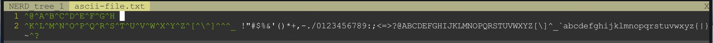

# README

## 获取xxd格式文件

    bash print-in-xxd-format.sh | vim -c 'set fencs=latin1 enc=latin1 fenc=latin1' - 

## vim操作

    :%!xxd -r
    :w ascii-file.txt
    :q

## 输出ascii码表

    cat ascii-file.txt | od -a -A d
    0000000  nul soh stx etx eot enq ack bel  bs  ht  nl  vt  ff  cr  so  si
    0000016  dle dc1 dc2 dc3 dc4 nak syn etb can  em sub esc  fs  gs  rs  us
    0000032   sp   !   "   #   $   %   &   '   (   )   *   +   ,   -   .   /
    0000048    0   1   2   3   4   5   6   7   8   9   :   ;   <   =   >   ?
    0000064    @   A   B   C   D   E   F   G   H   I   J   K   L   M   N   O
    0000080    P   Q   R   S   T   U   V   W   X   Y   Z   [   \   ]   ^   _
    0000096    `   a   b   c   d   e   f   g   h   i   j   k   l   m   n   o
    0000112    p   q   r   s   t   u   v   w   x   y   z   {   |   }   ~ del
    0000128   nl
    0000129

    cat ascii-file.txt | od -c -A d
    0000000   \0 001 002 003 004 005 006  \a  \b  \t  \n  \v  \f  \r 016 017
    0000016  020 021 022 023 024 025 026 027 030 031 032 033 034 035 036 037
    0000032        !   "   #   $   %   &   '   (   )   *   +   ,   -   .   /
    0000048    0   1   2   3   4   5   6   7   8   9   :   ;   <   =   >   ?
    0000064    @   A   B   C   D   E   F   G   H   I   J   K   L   M   N   O
    0000080    P   Q   R   S   T   U   V   W   X   Y   Z   [   \   ]   ^   _
    0000096    `   a   b   c   d   e   f   g   h   i   j   k   l   m   n   o
    0000112    p   q   r   s   t   u   v   w   x   y   z   {   |   }   ~ 177
    0000128   \n
    0000129

## vim内查看ascii-file.txt

    ^G  bel     响铃
    ^H  bs      回退

